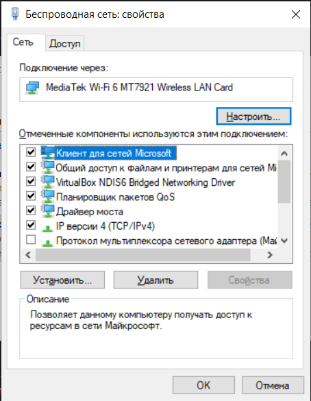

# Ход выполнения работы

## 1
1) Открыл параметры 

*"Панель управления\Все элементы панели управления\Сетевые подключения"*. В быстрых действиях (Win+R) выполнил `ncpa.cpl`.


2) ПКМ -> Свойства

Необходимые пункты в свойствах используемого сетевого подключения **активны**.



3) Определил назначения компонентов

- `Клиент для сетей Microsoft`

Позволяет данному компьютеру *получать доступ* к ресурсам в сети Майкрософт. Обеспечивает поддержку сетевых функций, таких как доступ к общим файлам, принтерам и другим сетевым ресурсам.

Отвечает за подключение к сетевым ресурсам, использующим протокол **SMB** (Server Message Block - протокол для обмена данными в локальной сети).

- `Служба доступа к файлам и принтерам Microsoft`

Служба отвечает за *предоставление доступа* к общим ресурсам (файлам и принтерам) другим устройствам в сети. Если эта служба отключена, другие компьютеры не смогут получить доступ к общим папкам или принтерам на этом устройстве. Она работает поверх протокола SMB и использует TCP/IP для передачи данных.

- `Протокол TCP/IP`

TCP/IP (Transmission Control Protocol/Internet Protocol) — это набор сетевых протоколов, который отвечает за маршрутизацию данных между устройствами.

IP - сетевой протокол, который отвечает за адресацию и маршрутизацию пакетов.

TCP - транспортный протокол, который обеспечивает надежную доставку данных, проверяя целостность и порядок пакетов.

## 2

В свойствах сети снять галочку с пункта `Общий доступ к файлам и принтерам для сетей Microsoft`


## 3

### Назначении параметров и ключей утилиты `ping`

Утилита используется для проверки доступности устройства или хоста в сети, а также для измерения времени, которое требуется для отправки и получения данных от этого устройства.

Использование: `ping [-параметры] конечный_узел`

<details> <summary>Параметры</summary>

| Ключ | Описание |
|-|-|
  -t                   | Проверяет связь с указанным узлом до прекращения. Для отображения статистики и продолжения проверки нажмите клавиши CTRL+BREAK; для прекращения нажмите CTRL+C.
  -a                   | Разрешает адреса в имена узлов.
  -n \<число>          | Число отправляемых запросов проверки связи.
  -l \<размер>         | Размер буфера отправки.
  -f                   | Устанавливает флаг, запрещающий фрагментацию, в пакете (только IPv4).
  -i \<TTL>            | Срок жизни пакетов.
  -r <число>           | Записывает маршрут для указанного числа прыжков (только IPv4).
  -s <число>           | Задает метку времени для указанного числа прыжков (только IPv4).
  -j <список_узлов>    | Задает свободный выбор маршрута по списку узлов (только IPv4).
  -k <список_узлов>    | Задает жесткий выбор маршрута по списку узлов (только IPv4).
  -w <время_ожидания>  | Задает время ожидания каждого ответа (в миллисекундах).
  -S <адрес_источника> | Задает адрес источника.
  -c секция            | Идентификатор секции маршрутизации.
  -p                   | Проверяет связь с сетевым адресом поставщика виртуализации Hyper-V.
  -4                   | Задает принудительное использование протокола IPv4.
  -6                   | Задает принудительное использование протокола IPv6.

</details>

### Использование команды `ping`

a. Проверка доступности удаленного хоста:
```PowerShell
PS D:\ITMO.STUDY\COMPNET> ping isu.ifmo.ru

Обмен пакетами с isu.ifmo.ru [77.234.212.21] с 32 байтами данных:
Ответ от 77.234.212.21: число байт=32 время=12мс TTL=57
Ответ от 77.234.212.21: число байт=32 время=13мс TTL=57
Ответ от 77.234.212.21: число байт=32 время=12мс TTL=57
Ответ от 77.234.212.21: число байт=32 время=13мс TTL=57

Статистика Ping для 77.234.212.21:
    Пакетов: отправлено = 4, получено = 4, потеряно = 0
    (0% потерь)
Приблизительное время приема-передачи в мс:
    Минимальное = 12мсек, Максимальное = 13 мсек, Среднее = 12 мсек
```

b. Запуск бесконечной проверки доступности:
```PowerShell
PS D:\ITMO.STUDY\COMPNET> ping -t isu.ifmo.ru

Обмен пакетами с isu.ifmo.ru [77.234.212.21] с 32 байтами данных:
Ответ от 77.234.212.21: число байт=32 время=13мс TTL=57
Ответ от 77.234.212.21: число байт=32 время=12мс TTL=57
Ответ от 77.234.212.21: число байт=32 время=19мс TTL=57
Ответ от 77.234.212.21: число байт=32 время=12мс TTL=57
Ответ от 77.234.212.21: число байт=32 время=12мс TTL=57
Ответ от 77.234.212.21: число байт=32 время=23мс TTL=57
Ответ от 77.234.212.21: число байт=32 время=17мс TTL=57
Ответ от 77.234.212.21: число байт=32 время=13мс TTL=57

Статистика Ping для 77.234.212.21:
    Пакетов: отправлено = 8, получено = 8, потеряно = 0
    (0% потерь)
Приблизительное время приема-передачи в мс:
    Минимальное = 12мсек, Максимальное = 23 мсек, Среднее = 15 мсек
Control-C
```

c. Ограничение числа запросов:
```PowerShell
PS D:\ITMO.STUDY\COMPNET> ping -n 6 isu.ifmo.ru

Обмен пакетами с isu.ifmo.ru [77.234.212.21] с 32 байтами данных:
Ответ от 77.234.212.21: число байт=32 время=13мс TTL=57
Ответ от 77.234.212.21: число байт=32 время=13мс TTL=57
Ответ от 77.234.212.21: число байт=32 время=12мс TTL=57
Ответ от 77.234.212.21: число байт=32 время=13мс TTL=57
Ответ от 77.234.212.21: число байт=32 время=13мс TTL=57
Ответ от 77.234.212.21: число байт=32 время=13мс TTL=57

Статистика Ping для 77.234.212.21:
    Пакетов: отправлено = 6, получено = 6, потеряно = 0
    (0% потерь)
Приблизительное время приема-передачи в мс:
    Минимальное = 12мсек, Максимальное = 13 мсек, Среднее = 12 мсек
```

d. Изменение размера пакетов:
```PowerShell
PS D:\ITMO.STUDY\COMPNET> ping -l 1000 isu.ifmo.ru

Обмен пакетами с isu.ifmo.ru [77.234.212.21] с 1000 байтами данных:
Ответ от 77.234.212.21: число байт=1000 время=13мс TTL=57
Ответ от 77.234.212.21: число байт=1000 время=13мс TTL=57
Ответ от 77.234.212.21: число байт=1000 время=13мс TTL=57
Ответ от 77.234.212.21: число байт=1000 время=13мс TTL=57

Статистика Ping для 77.234.212.21:
    Пакетов: отправлено = 4, получено = 4, потеряно = 0
    (0% потерь)
Приблизительное время приема-передачи в мс:
    Минимальное = 13мсек, Максимальное = 13 мсек, Среднее = 13 мсек
```

f. Сохранение результатов в файл:
```PowerShell
PS D:\ITMO.STUDY\COMPNET> ping isu.ifmo.ru > result_3f.txt
```
Содержание [файла](/result_3f.txt)

## 4

### Назначении параметров и ключей утилиты `tracert`

Утилита используется для отслеживания маршрута, который сетевой пакет проходит от вашего компьютера к удаленному хосту.

Использование: `tracert [-параметры] конечное_имя`

<details> <summary>Параметры</summary>

| Ключ | Описание |
|-|-|
-d                 | Без разрешения в имена узлов.
-h макс_число      | Максимальное число прыжков при поиске узла.
-j список_узлов    | Свободный выбор маршрута по списку узлов (только IPv4).
-w таймаут         | Таймаут каждого ответа в миллисекундах.
-R                 | Трассировка пути (только IPv6).
-S адрес_источника | Используемый адрес источника (только IPv6).
-4                 | Принудительное использование IPv4.
-6                 | Принудительное использование IPv6.

</details>

### Использование команды `tracert`

a. Отслеживание маршрута к удаленному хосту:
```PowerShell
PS D:\ITMO.STUDY\COMPNET\lab1> tracert my.itmo.ru

Трассировка маршрута к my.itmo.ru [158.160.35.173]
с максимальным числом прыжков 30:

  1     1 ms     1 ms     1 ms  192.168.1.1
  2    41 ms    25 ms    24 ms  5x19x0x126.static-business.spb.ertelecom.ru [5.19.0.126]
  3     5 ms     4 ms     3 ms  5x19x0x201.static-business.spb.ertelecom.ru [5.19.0.201]
  4     4 ms     3 ms     3 ms  as9049.ix.dataix.eu [178.18.224.152]
  5     *        *        *     Превышен интервал ожидания для запроса.
  6     *        *        *     Превышен интервал ожидания для запроса.
  7     *        *        *     Превышен интервал ожидания для запроса.
  8     *        *        *     Превышен интервал ожидания для запроса.
  9     *        *        *     Превышен интервал ожидания для запроса.
 10     *        *        *     Превышен интервал ожидания для запроса.
 11     *        *        *     Превышен интервал ожидания для запроса.
 12     *        *        *     Превышен интервал ожидания для запроса.
 13    19 ms    19 ms    19 ms  158.160.35.173
```

b. Изменение максимального количества прыжков (хопов):
```PowerShell
PS D:\ITMO.STUDY\COMPNET\lab1> tracert -h 50 google.com

Трассировка маршрута к google.com [64.233.163.102]
с максимальным числом прыжков 50:

  1     1 ms     1 ms     1 ms  192.168.1.1
  2   150 ms   212 ms   105 ms  5x19x0x122.static-business.spb.ertelecom.ru [5.19.0.122]
  3     8 ms    12 ms     9 ms  5x19x0x201.static-business.spb.ertelecom.ru [5.19.0.201]
  4     3 ms     3 ms     4 ms  bbr03.spb.ertelecom.ru [188.234.152.203]
  5     3 ms     4 ms     3 ms  188x234x131x159.ertelecom.ru [188.234.131.159]
  6     8 ms     4 ms     4 ms  172.253.76.89
  7     7 ms     5 ms     3 ms  74.125.244.132
  8     4 ms     5 ms     4 ms  72.14.232.85
  9     8 ms     8 ms     7 ms  142.251.61.221
 10     8 ms     8 ms     8 ms  142.250.56.131
 11     *        *        *     Превышен интервал ожидания для запроса.
 12     *        *        *     Превышен интервал ожидания для запроса.
 13     *        *        *     Превышен интервал ожидания для запроса.
 14     *        *        *     Превышен интервал ожидания для запроса.
 15     *        *        *     Превышен интервал ожидания для запроса.
 16     *        *        *     Превышен интервал ожидания для запроса.
 17     *        *        *     Превышен интервал ожидания для запроса.
 18     *        *        *     Превышен интервал ожидания для запроса.
 19     *        *        *     Превышен интервал ожидания для запроса.
 20     7 ms     7 ms     7 ms  lj-in-f102.1e100.net [64.233.163.102]

Трассировка завершена.
```

c. Изменение времени ожидания для каждого хопа:
```PowerShell
PS D:\ITMO.STUDY\COMPNET\lab1> tracert -w 100 isu.ifmo.ru

Трассировка маршрута к isu.ifmo.ru [77.234.212.21]
с максимальным числом прыжков 30:

  1     1 ms     1 ms     1 ms  192.168.1.1
  2   396 ms     *      210 ms  5x19x0x126.static-business.spb.ertelecom.ru [5.19.0.126]
  3     4 ms     3 ms     5 ms  5x19x0x205.static-business.spb.ertelecom.ru [5.19.0.205]
  4     4 ms     4 ms     3 ms  spb-ix.ertelecom.ru [194.226.100.41]
  5    12 ms    13 ms    12 ms  spb-ix.runnet.ru [194.226.100.36]
  6    20 ms    12 ms    12 ms  63.ae0.gw5.kt12.spb.niks.su [194.85.42.128]
  7    17 ms    18 ms    20 ms  3557.ae1.kt12-5-gw.spb.niks.su [194.85.36.66]
  8    15 ms    14 ms    14 ms  isu.ifmo.ru [77.234.212.21]

Трассировка завершена.
```

## 5
### Назначении параметров и ключей утилиты `ipconfig`

Утилита командной строки для вывода деталей текущего соединения и управления клиентскими сервисами DHCP и DNS.

Использование `ipconfig [/allcompartments] [/параметры]`

<details> <summary>Параметры</summary>

| Ключ | Описание |
|------|----------|
/allcompartments        | Отображение сведений обо всех секциях.
/all                    | Отображение полной информации по всем адаптерам.
/release [адаптер]	    | Отправка сообщения DHCPRELEASE серверу DHCP для освобождения текущей конфигурации DHCP и удаления конфигурации IP-адресов для всех адаптеров (если адаптер не задан) или для заданного адаптера. Этот ключ отключает протокол TCP/IP для адаптеров, настроенных для автоматического получения IP-адресов.
/renew                  | Обновление IP-адреса для определённого адаптера или если адаптер не задан, то для всех. Доступно только при настроенном автоматическом получении IP-адресов.
/flushdns               | Очищение DNS кэша.
/registerdns            | Обновление всех зарезервированных адресов DHCP и перерегистрация имен DNS.
/displaydns             | Отображение содержимого кэша DNS.
/showclassid адаптер    | Отображение кода класса DHCP для указанного адаптера. Доступно только при настроенном автоматическим получением IP-адресов.
/setclassid адаптер [код_класса] | Изменение кода класса DHCP. Доступно только при настроенном автоматическим получением IP-адресов.
/? | Справка.

`адаптер` - имя подключения (можно использовать знаки подстановки * and ?)

Если для параметра SetClassid или SetClassid6 не указан идентификатор класса,
то существующий идентификатор класса будет удален.

</details>

### Использование команды `ipconfig`

a. Отображение полной информации по всем адаптерам:
```PowerShell
PS C:\Users\User> ipconfig /all

Настройка протокола IP для Windows

   Имя компьютера  . . . . . . . . . : LAPTOP-74P62JOB
   Основной DNS-суффикс  . . . . . . :
   Тип узла. . . . . . . . . . . . . : Гибридный
   IP-маршрутизация включена . . . . : Нет
   WINS-прокси включен . . . . . . . : Нет

Адаптер Ethernet Ethernet:

   Состояние среды . . . . . . . . . : Среда передачи недоступна.
   DNS-суффикс подключения . . . . . :
   Описание. . . . . . . . . . . . . : Realtek Gaming GbE Family Controller
   Физический адрес. . . . . . . . . : 7C-10-C9-AD-D3-95
   DHCP включен. . . . . . . . . . . : Да
   Автонастройка включена. . . . . . : Да

Адаптер Ethernet VirtualBox Host-Only Network:

...

Адаптер беспроводной локальной сети Беспроводная сеть:

   DNS-суффикс подключения . . . . . :
   Описание. . . . . . . . . . . . . : MediaTek Wi-Fi 6 MT7921 Wireless LAN Card
   Физический адрес. . . . . . . . . : 48-E7-DA-43-BE-13
   DHCP включен. . . . . . . . . . . : Да
   Автонастройка включена. . . . . . : Да
   Локальный IPv6-адрес канала . . . : fe80::2240:1e23:ea61:b804%12(Основной)
   IPv4-адрес. . . . . . . . . . . . : 192.168.1.102(Основной)
   Маска подсети . . . . . . . . . . : 255.255.255.0
   Аренда получена . . . . . . . . . : 8 марта 2025 г. 23:54:37
   Срок аренды истекает. . . . . . . : 9 марта 2025 г. 1:54:37
   Основной шлюз . . . . . . . . . . : 192.168.1.1
   DHCP-сервер . . . . . . . . . . . : 192.168.1.1
   IAID DHCPv6 . . . . . . . . . . . : 390653914
   DUID клиента DHCPv6 . . . . . . . : 00-01-00-01-2A-CD-C6-55-7C-10-C9-AD-D3-95
   DNS-серверы . . . . . . . . . . . : 192.168.1.1
   NetBios через TCP/IP. . . . . . . : Включен

Адаптер Ethernet Сетевое подключение Bluetooth:

   Состояние среды . . . . . . . . . : Среда передачи недоступна.
   DNS-суффикс подключения . . . . . :
   Описание. . . . . . . . . . . . . : Bluetooth Device (Personal Area Network)
   Физический адрес. . . . . . . . . : 48-E7-DA-43-BE-12
   DHCP включен. . . . . . . . . . . : Да
   Автонастройка включена. . . . . . : Да
```

b. Очистка кеша DNS:
```PowerShell
PS C:\Users\User> ipconfig /flushdns

Настройка протокола IP для Windows

Кэш сопоставителя DNS успешно очищен.
``` 

c. Регистрация записей ресурса DNS:
```PowerShell
PS C:\Windows\system32> ipconfig /registerdns

Настройка протокола IP для Windows

Начата регистрация записей ресурсов DNS для всех адаптеров этого компьютера. Отчет об ошибках будет выведен в окне "Просмотр событий" через 15 минут.
```

d. Перерезервирование и обновление DHCP:
```PowerShell
PS C:\Windows\system32> ipconfig /release

Настройка протокола IP для Windows
...

Адаптер беспроводной локальной сети Беспроводная сеть:

   DNS-суффикс подключения . . . . . :
   Локальный IPv6-адрес канала . . . : fe80::2240:1e23:ea61:b804%12
   Основной шлюз. . . . . . . . . :

...

PS C:\Windows\system32> ipconfig /renew

Настройка протокола IP для Windows

...

Адаптер беспроводной локальной сети Беспроводная сеть:

   DNS-суффикс подключения . . . . . :
   Локальный IPv6-адрес канала . . . : fe80::2240:1e23:ea61:b804%12
   IPv4-адрес. . . . . . . . . . . . : 192.168.1.102
   Маска подсети . . . . . . . . . . : 255.255.255.0
   Основной шлюз. . . . . . . . . : 192.168.1.1

...

```

### Назначении параметров и ключей утилиты `net`

Утилита net в Windows используется для управления сетевыми ресурсами, службами, пользователями и другими аспектами системы.

Использование `net [директива]`

<details> <summary>Директивы</summary>

| Директива       | Значение                                                                |
|-----------------|-------------------------------------------------------------------------|
| `net use`       | Управление сетевыми подключениями (диски, принтеры и т.д.).             |
| `net view`      | Просмотр сетевых ресурсов или компьютеров.                              |
| `net stop`      | Остановка службы или сервиса.                                           |
| `net start`     | Запуск службы или сервиса.                                              |
| `net share`     | Управление общими ресурсами (папками).                                  |
| `net config`    | Просмотр или изменение конфигурации сервера или рабочей станции.        |
| `net session`   | Управление сессиями пользователей на сервере.                           |
| `net user`      | Управление учетными записями пользователей.                             |
| `net statistics`| Просмотр статистики по серверу или рабочей станции.                     |
| `net localgroup`| Управление локальными группами (добавление, удаление пользователей).    |

</details>

### Использование команды `net`

[Исправление ошибки 6118](https://mywebpc.ru/windows/sistemnaya-oshibka-6118-cmd/)

[Работа с сетью в командной строке Windows (CMD)](https://uzverss.livejournal.com/35795.html)

a. Просмотр сетевых ресурсов и компьютеров:
```PowerShell
PS C:\Windows\system32> net view
Имя сервера            Заметки

-------------------------------------------------------------------------------
\\DESKTOP-VSF34V9
\\LAPTOP-74P62JOB
\\WIN-JE23C730F2B
Команда выполнена успешно.
```

b. Скрыть и вновь показать компьютер в сетевом окружении:
```PowerShell
PS C:\Windows\system32> NET config server /hidden:no
Команда выполнена успешно.

PS C:\Windows\system32> NET config server /hidden:yes
Команда выполнена успешно.

```

c. Подключение к общей сетевой папке:
```PowerShell
PS C:\Windows\system32> net use
Новые подключения будут запомнены.

В списке нет элементов.

PS C:\Windows\system32> net use \\WIN-JE23C730F2B
Команда выполнена успешно.

PS C:\Windows\system32> net use
Новые подключения будут запомнены.


Состояние   Локальный  Удаленный                 Сеть

-------------------------------------------------------------------------------
OK                     \\WIN-JE23C730F2B\IPC$    Microsoft Windows Network
Команда выполнена успешно.

PS C:\Windows\system32> cd \\WIN-JE23C730F2B\Users
PS Microsoft.PowerShell.Core\FileSystem::\\WIN-JE23C730F2B\Users>
```

d. Предоставление и закрытие доступа к файлу по сети:
```PowerShell
PS C:\Users\Администратор> net share TEMP="C:\Users\Администратор\Documents"
TEMP успешно назначен общим.

PS C:\Users\Администратор> net share TEMP /DELETE
Пользователи имеют на TEMP открытые файлы.  Продолжение операции приведет к закрытию файлов.

Вы хотите продолжить операцию? (Y-да/N-нет) [N]: y
TEMP успешно удален.
```

e. Отобразить список групп пользователей данного компьютера:
```PowerShell
PS C:\Users\Администратор> net localgroup

Псевдонимы для \\WIN-JE23C730F2B

-------------------------------------------------------------------------------
*IIS_IUSRS
*WinRMRemoteWMIUsers__
*Администраторы
*Администраторы Hyper-V
*Гости
*Доступ DCOM службы сертификации
*Криптографические операторы
*Операторы архива
*Операторы настройки сети
*Операторы печати
*Операторы помощи по контролю учетных записей
*Опытные пользователи
*Пользователи
*Пользователи DCOM
*Пользователи журналов производительности
*Пользователи системного монитора
*Пользователи удаленного рабочего стола
*Пользователи удаленного управления
*Репликатор
*Серверы конечных точек RDS
*Серверы удаленного доступа RDS
*Серверы управления RDS
*Читатели журнала событий
Команда выполнена успешно.
```

## 6

[Статья: переменные batch](https://www.geeksforgeeks.org/basics-of-batch-scripting/)

[Статья: база batch](https://habr.com/ru/articles/60604/)

Использование: 
- `script6.bat dhcp "Беспроводная сеть"`
- `script6.bat static "Беспроводная сеть" 192.168.1.77 255.255.255.0 192.168.1.1 8.8.8.8`

Проверка результата:
- `netsh interface ip show config name="Беспроводная сеть"`

### Код:
```PowerShell
@echo off
chcp 65001 > nul
setlocal enabledelayedexpansion

:: Считываем параметры
set "mode=%~1"
set "interface=%~2"
set "address=%~3"
set "mask=%~4"
set "gateway=%~5"
set "dns=%~6"

:: Выбор режима
:choose_mode
if /i "%mode%"=="exit" goto end
if /i "%mode%"=="?" goto help
if /i "%mode%"=="/?" goto help
if /i "%mode%"=="help" goto help
if /i "%mode%"=="dhcp" goto check_interface
if /i "%mode%"=="static" goto check_interface

:invalid_mode
echo Неверный режим: "%mode%"
set "mode="
set /p "mode=Выберите режим (dhcp|static|help|exit): "
goto choose_mode

:: Проверка интерфейса
:check_interface
if "%interface%"=="" goto request_interface

netsh interface show interface "%interface%" >nul 2>&1
if %errorlevel% neq 0 (
    echo Ошибка: Интерфейс "%interface%" не найден!
    set "interface="
    goto request_interface
) else (
    goto process_mode
)

:request_interface
set /p "interface=Введите название интерфейса: "
goto check_interface

:: Обработка режима
:process_mode
if /i "%mode%"=="dhcp" (
    echo Настройка по DHCP...
    netsh interface ip set address name="%interface%" source=dhcp
    netsh interface ip set dns name="%interface%" source=dhcp
    goto result_check
)

:static_mode
echo Режим статической настройки

:: Ввод IP
:get_ip
if "%address%"=="" (
    set /p "address=Введите IP-адрес: "
    goto get_ip
)

:: Ввод маски
:get_mask
if "%mask%"=="" (
    set /p "mask=Введите маску подсети: "
    goto get_mask
)

:: Ввод шлюза
:get_gateway
if "%gateway%"=="" (
    set /p "gateway=Введите основной шлюз: "
    goto get_gateway
)

:: Ввод DNS
:get_dns
if "%dns%"=="" (
    set /p "dns=Введите DNS-сервер: "
    goto get_dns
)

:: Применение настроек
echo Применение заданных параметров...
netsh interface ip set address name="%interface%" source=static address="%address%" mask="%mask%" gateway="%gateway%"
netsh interface ip set dns name="%interface%" static "%dns%"

:result_check
echo Результат:
netsh interface ip show config name="%interface%"
goto end

:: Справка
:help
echo Автоматическая настройка:  %~nx0 dhcp "Имя интерфейса"
echo Пример ручной настройки:   %~nx0 static "Имя интерфейса" 192.168.1.77 255.255.255.0 192.168.1.1 8.8.8.8
echo В интерактивном режиме просто введите нужные параметры по запросу.

:end
endlocal
```

### Результат:

```PowerShell
D:\ITMO.STUDY\COMPNET\lab1>netsh interface ip show config name="Беспроводная сеть"

Configuration for interface "Беспроводная сеть"
    DHCP enabled:                         Yes
    IP Address:                           192.168.1.104
    Subnet Prefix:                        192.168.1.0/24 (mask 255.255.255.0)
    Default Gateway:                      192.168.1.1
    Gateway Metric:                       0
    InterfaceMetric:                      35
    DNS servers configured through DHCP:  192.168.1.1
    Register with which suffix:           Primary only
    WINS servers configured through DHCP: None


D:\ITMO.STUDY\COMPNET\lab1>script6.bat static "Беспроводная сеть" 192.168.1.100 255.255.255.0 192.168.1.1 8.8.8.8
Режим статической настройки
Применение заданных параметров...


The configured DNS server is incorrect or does not exist.

Результат:

Configuration for interface "Беспроводная сеть"
    DHCP enabled:                         No
    Default Gateway:                      192.168.1.1
    Gateway Metric:                       1
    InterfaceMetric:                      35
    Statically Configured DNS Servers:    8.8.8.8
    Register with which suffix:           Primary only
    Statically Configured WINS Servers:   None


D:\ITMO.STUDY\COMPNET\lab1>script6.bat dhcp "Беспроводная сеть"
Настройка по DHCP...


Результат:

Configuration for interface "Беспроводная сеть"
    DHCP enabled:                         Yes
    InterfaceMetric:                      35
    DNS servers configured through DHCP:  None
    Register with which suffix:           Primary only
    WINS servers configured through DHCP: None


D:\ITMO.STUDY\COMPNET\lab1>
```

## 7

[Статья про PowerShell](https://habr.com/ru/articles/113913/)

Разрешение на выполнение скриптов `Set-ExecutionPolicy RemoteSigned -Scope CurrentUser`

### Код:
```PowerShell
# Ввод параметров при запуске
param(
    [Parameter(Position=0)]
    [ValidateSet('DHCP','Static','Info')]
    [string]$Mode,
    
    [Parameter(Position=1)]
    [string]$Interface,
    [Parameter(Position=2)]
    [string]$Address,
    [Parameter(Position=3)]
    [string]$Mask,
    [Parameter(Position=4)]
    [string]$Gateway,
    [Parameter(Position=5)]
    [string]$DNS,
    
    [switch]$Help,
    [switch]$List
)

# Отображение меню
function Show-Menu {
    Write-Host "=== Network Configurator ==="
    Write-Host "1. Configure DHCP"
    Write-Host "2. Configure Static IP"
    Write-Host "3. Show Interface Info"
    Write-Host "4. List Interfaces"
    Write-Host "5. Help"
    Write-Host "6. Exit"
}

# Отображение справки
function Show-Help {
    Write-Host "Usage:"
    Write-Host "  DHCP config:     .\script7.ps1 -Mode DHCP -Interface 'Ethernet'"
    Write-Host "  Static IP:       .\script7.ps1 -Mode Static 'Ethernet' 192.168.1.100 24 192.168.1.1 8.8.8.8"
    Write-Host "  Interface info:  .\script7.ps1 -Mode Info -Interface 'Ethernet'"
    Write-Host "  List interfaces: .\script7.ps1 -List"
    Write-Host "  Help:            .\script7.ps1 -Help"
}

# Флаг List - список всех интерфейсов
if ($List) {
    Get-NetAdapter
    exit
}
# Флаг Help - справка
if ($Help) { 
    Show-Help 
    exit
}

# Интерактивный режим, если режим работы не введён
if (-not $Mode) {
    Show-Menu
    $choice = Read-Host "Select action"
    
    switch ($choice) {
        '1' { $Mode = 'DHCP' }
        '2' { $Mode = 'Static' }
        '3' { $Mode = 'Info' }
        '4' { $List = $true }
        '5' { $Help = $true }
        '6' { exit }
    }
}

# Пункт меню List - список всех интерфейсов
if ($List) {
    Get-NetAdapter
    exit
}
# Пункт меню Help - справка
if ($Help) { 
    Show-Help 
    exit
}

# Проверка на ввод: имя интерфейса
if (-not $Interface) {
    $Interface = Read-Host "Enter interface name"
}

# Проверка на существование интерфейса
try {
    $Adapter = Get-NetAdapter -Name $Interface -ErrorAction Stop
}
catch {
    Write-Host "Error: Interface $Interface not found!"
    exit
}

# Выбор режима работы
switch ($Mode.ToUpper()) {
    'DHCP' {
        Set-NetIPInterface -InterfaceAlias $Interface -Dhcp Enabled
        Set-DnsClientServerAddress -InterfaceAlias $Interface -ResetServerAddresses

        Write-Host "DHCP configuration applied" -ForegroundColor Green
    }
    
    'STATIC' {
        if (-not $Address) { $Address = Read-Host "Enter IP address" }
        if (-not $Mask) { $Mask = Read-Host "Enter mask (e.g., 24)" }
        if (-not $Gateway) { $Gateway = Read-Host "Enter gateway" }
        if (-not $DNS) { $DNS = Read-Host "Enter DNS server" }
    
        Remove-NetIPAddress -InterfaceAlias $Interface -Confirm:$false
        New-NetIPAddress -InterfaceAlias $Interface -IPAddress $Address -PrefixLength $Mask -DefaultGateway $Gateway | Out-Null
        Set-DnsClientServerAddress -InterfaceAlias $Interface -ServerAddresses $DNS

        Write-Host "Static configuration applied" -ForegroundColor Green
    }
    
    'INFO' {
        # Получение инфы по адаптеру
        $AdapterInfo = Get-NetAdapter -Name $Interface | Select-Object *
        # Статус подключния
        $status = switch ($AdapterInfo.Status) {
            'Up' { 'Connected'; break }
            'Disconnected' { 'Disconnected'; break }
            default { $_ }
        }
        # Дуплекс
        $duplex = switch ($AdapterInfo.MediaDuplexState) {
            '0' { 'Unknown'; break }
            '1' { 'HalfDuplex'; break }
            '2' { 'FullDuplex'; break }
            '3' { 'Auto'; break }
            default { $_ }
        }

        Write-Host "Adapter information"
        Write-Host "Interface Name      =" $AdapterInfo.Name
        Write-Host "MAC Address         =" $AdapterInfo.MacAddress
        Write-Host "Adapter Model       =" $AdapterInfo.InterfaceDescription
        Write-Host "Status              =" $status
        # Write-Host "Physical Connection =" $AdapterInfo.MediaConnectionState
        Write-Host "Speed               =" $AdapterInfo.LinkSpeed
        Write-Host "Duplex Mode         =" $duplex
    }
}
```

### Результат:
```PowerShell
PS D:\ITMO.STUDY\COMPNET\lab1> ./script7.ps1
=== Network Configurator ===
1. Configure DHCP
2. Configure Static IP
3. Show Interface Info
4. List Interfaces
5. Help
6. Exit
Select action: 3
Enter interface name: Беспроводная сеть
Adapter information
Interface Name      = Беспроводная сеть
MAC Address         = 48-E7-DA-43-BE-13
Adapter Model       = MediaTek Wi-Fi 6 MT7921 Wireless LAN Card
Status              = Connected
Speed               = 866.7 Mbps
Duplex Mode         = HalfDuplex
PS D:\ITMO.STUDY\COMPNET\lab1> ./script7.ps1 static "Беспроводная сеть" 192.168.1.77 24 192.168.1.1 8.8.8.8
Static configuration applied
PS D:\ITMO.STUDY\COMPNET\lab1> ./script7.ps1 dhcp "Беспроводная сеть" 
DHCP configuration applied
```
# Вопросы и задания


1. Запрет доступа через конкретный сетевой интерфейс:
- Откройте Брандмауэр Защитника Windows → Дополнительные параметры.
- Создайте новое правило (входящее/исходящее) → выберите «Настраиваемое».
- На шаге «Область» укажите конкретные сетевые интерфейсы в разделе «Интерфейсы».
- Выберите «Блокировать подключение» → примените к нужным профилям (частная, публичная сеть).
Запрет доступа к ресурсам других компьютеров:
- Через Центр управления сетями и общим доступом
- Изменение параметров общего доступа → Отключить сетевое обнаружение и Общий доступ к файлам и принтерам.


2. Директивы `net`
| Директива       | Значение                                                                |
|-----------------|-------------------------------------------------------------------------|
| `net use`       | Управление сетевыми подключениями (диски, принтеры и т.д.).             |
| `net view`      | Просмотр сетевых ресурсов или компьютеров.                              |
| `net stop`      | Остановка службы или сервиса.                                           |
| `net start`     | Запуск службы или сервиса.                                              |
| `net share`     | Управление общими ресурсами (папками).                                  |
| `net config`    | Просмотр или изменение конфигурации сервера или рабочей станции.        |
| `net session`   | Управление сессиями пользователей на сервере.                           |
| `net user`      | Управление учетными записями пользователей.                             |
| `net statistics`| Просмотр статистики по серверу или рабочей станции.                     |
| `net localgroup`| Управление локальными группами (добавление, удаление пользователей).    |


3. `ipconfig /all`

4. `net use` подключает сетевые ресурсы.

```cmd
net use R: \\SRV\TEST /persistent:yes
```

5. Через `Rename-NetAdapter`
```PowerShell
Rename-NetAdapter -Name "Старое" -NewName "Новое"
```
6. Режимы дуплекса:
- *Полудуплекс*: Передача в одну сторону за раз.
- *Полный дуплекс*: Одновременная передача/прием.
- *Автосогласование*: Автоматический выбор режима.