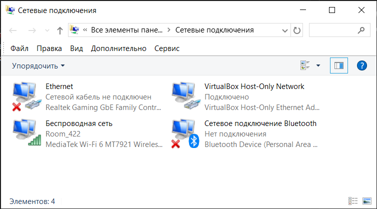
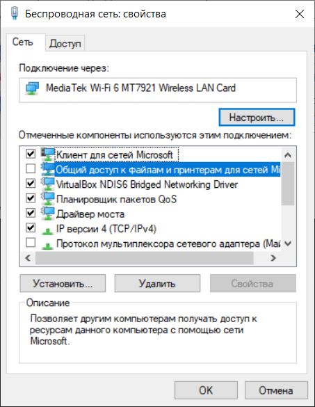

# Ход выполнения работы

## 1
1) Открыл параметры 

*"Панель управления\Все элементы панели управления\Сетевые подключения"*. В быстрых действиях (Win+R) выполнил `ncpa.cpl`.



2) ПКМ -> Свойства

Необходимые пункты в свойствах используемого сетевого подключения **активны**.


3) Определил назначения компонентов

- `Клиент для сетей Microsoft`

Позволяет данному компьютеру *получать доступ* к ресурсам в сети Майкрософт. Обеспечивает поддержку сетевых функций, таких как доступ к общим файлам, принтерам и другим сетевым ресурсам.

Отвечает за подключение к сетевым ресурсам, использующим протокол **SMB** (Server Message Block - протокол для обмена данными в локальной сети).

- `Служба доступа к файлам и принтерам Microsoft`

Служба отвечает за *предоставление доступа* к общим ресурсам (файлам и принтерам) другим устройствам в сети. Если эта служба отключена, другие компьютеры не смогут получить доступ к общим папкам или принтерам на этом устройстве. Она работает поверх протокола SMB и использует TCP/IP для передачи данных.

- `Протокол TCP/IP`

TCP/IP (Transmission Control Protocol/Internet Protocol) — это набор сетевых протоколов, который отвечает за маршрутизацию данных между устройствами.

IP - сетевой протокол, который отвечает за адресацию и маршрутизацию пакетов.

TCP - транспортный протокол, который обеспечивает надежную доставку данных, проверяя целостность и порядок пакетов.

## 2

В свойствах сети снять галочку с пункта `Общий доступ к файлам и принтерам для сетей Microsoft`



## 3

### Назначении параметров и ключей утилиты `ping`: 

`PS D:\> ping /?`
<details> <summary>output</summary>
    
```PowerShell
Использование: ping [-параметры] конечный_узел

Параметры:
  -t                   Проверяет связь с указанным узлом до прекращения. Для отображения статистики и продолжения проверки нажмите клавиши CTRL+BREAK; для прекращения нажмите CTRL+C.
  -a                   Разрешает адреса в имена узлов.
  -n <число>           Число отправляемых запросов проверки связи.
  -l <размер>          Размер буфера отправки.
  -f                   Устанавливает флаг, запрещающий фрагментацию, в пакете (только IPv4).
  -i <TTL>             Срок жизни пакетов.
  -r <число>           Записывает маршрут для указанного числа прыжков (только IPv4).
  -s <число>           Задает метку времени для указанного числа прыжков (только IPv4).
  -j <список_узлов>    Задает свободный выбор маршрута по списку узлов (только IPv4).
  -k <список_узлов>    Задает жесткий выбор маршрута по списку узлов (только IPv4).
  -w <время_ожидания>  Задает время ожидания каждого ответа (в миллисекундах).
  -S <адрес_источника> Задает адрес источника.
  -c секция            Идентификатор секции маршрутизации.
  -p                   Проверяет связь с сетевым адресом поставщика виртуализации Hyper-V.
  -4                   Задает принудительное использование протокола IPv4.
  -6                   Задает принудительное использование протокола IPv6.
```
</details>

### Использование комманды

a. Проверка доступности удаленного хоста:
```PowerShell
PS D:\ITMO.STUDY\COMPNET> ping isu.ifmo.ru

Обмен пакетами с isu.ifmo.ru [77.234.212.21] с 32 байтами данных:
Ответ от 77.234.212.21: число байт=32 время=12мс TTL=57
Ответ от 77.234.212.21: число байт=32 время=13мс TTL=57
Ответ от 77.234.212.21: число байт=32 время=12мс TTL=57
Ответ от 77.234.212.21: число байт=32 время=13мс TTL=57

Статистика Ping для 77.234.212.21:
    Пакетов: отправлено = 4, получено = 4, потеряно = 0
    (0% потерь)
Приблизительное время приема-передачи в мс:
    Минимальное = 12мсек, Максимальное = 13 мсек, Среднее = 12 мсек
```

b. Запуск бесконечной проверки доступности:
```PowerShell
PS D:\ITMO.STUDY\COMPNET> ping -t isu.ifmo.ru

Обмен пакетами с isu.ifmo.ru [77.234.212.21] с 32 байтами данных:
Ответ от 77.234.212.21: число байт=32 время=13мс TTL=57
Ответ от 77.234.212.21: число байт=32 время=12мс TTL=57
Ответ от 77.234.212.21: число байт=32 время=19мс TTL=57
Ответ от 77.234.212.21: число байт=32 время=12мс TTL=57
Ответ от 77.234.212.21: число байт=32 время=12мс TTL=57
Ответ от 77.234.212.21: число байт=32 время=23мс TTL=57
Ответ от 77.234.212.21: число байт=32 время=17мс TTL=57
Ответ от 77.234.212.21: число байт=32 время=13мс TTL=57

Статистика Ping для 77.234.212.21:
    Пакетов: отправлено = 8, получено = 8, потеряно = 0
    (0% потерь)
Приблизительное время приема-передачи в мс:
    Минимальное = 12мсек, Максимальное = 23 мсек, Среднее = 15 мсек
Control-C
```

c. Ограничение числа запросов:
```PowerShell
PS D:\ITMO.STUDY\COMPNET> ping -n 6 isu.ifmo.ru

Обмен пакетами с isu.ifmo.ru [77.234.212.21] с 32 байтами данных:
Ответ от 77.234.212.21: число байт=32 время=13мс TTL=57
Ответ от 77.234.212.21: число байт=32 время=13мс TTL=57
Ответ от 77.234.212.21: число байт=32 время=12мс TTL=57
Ответ от 77.234.212.21: число байт=32 время=13мс TTL=57
Ответ от 77.234.212.21: число байт=32 время=13мс TTL=57
Ответ от 77.234.212.21: число байт=32 время=13мс TTL=57

Статистика Ping для 77.234.212.21:
    Пакетов: отправлено = 6, получено = 6, потеряно = 0
    (0% потерь)
Приблизительное время приема-передачи в мс:
    Минимальное = 12мсек, Максимальное = 13 мсек, Среднее = 12 мсек
```

d. Изменение размера пакетов:
```PowerShell
PS D:\ITMO.STUDY\COMPNET> ping -l 1000 isu.ifmo.ru

Обмен пакетами с isu.ifmo.ru [77.234.212.21] с 1000 байтами данных:
Ответ от 77.234.212.21: число байт=1000 время=13мс TTL=57
Ответ от 77.234.212.21: число байт=1000 время=13мс TTL=57
Ответ от 77.234.212.21: число байт=1000 время=13мс TTL=57
Ответ от 77.234.212.21: число байт=1000 время=13мс TTL=57

Статистика Ping для 77.234.212.21:
    Пакетов: отправлено = 4, получено = 4, потеряно = 0
    (0% потерь)
Приблизительное время приема-передачи в мс:
    Минимальное = 13мсек, Максимальное = 13 мсек, Среднее = 13 мсек
```

f. Сохранение результатов в файл:
```PowerShell
PS D:\ITMO.STUDY\COMPNET> ping isu.ifmo.ru > result_3f.txt
```
Содержание [файла](/result_3f.txt)

## 4

### Назначении параметров и ключей утилиты `tracert`: 

`PS D:\> tracert /? `
<details> <summary>output</summary>
    
```
Использование: tracert [-параметры] конечное_имя

Параметры:
    -d                Без разрешения в имена узлов.
    -h максЧисло      Максимальное число прыжков при поиске узла.
    -j списокУзлов    Свободный выбор маршрута по списку узлов (только IPv4).
    -w таймаут        Таймаут каждого ответа в миллисекундах.
    -R                Трассировка пути (только IPv6).
    -S адрес          Источника Используемый адрес источника (только IPv6).
    -4                Принудительное использование IPv4.
    -6                Принудительное использование IPv6.
```
</details>

### Использование комманды

a. Отслеживание маршрута к удаленному хосту:
```PowerShell
PS D:\ITMO.STUDY\COMPNET\lab1> tracert my.itmo.ru

Трассировка маршрута к my.itmo.ru [158.160.35.173]
с максимальным числом прыжков 30:

  1     1 ms     1 ms     1 ms  192.168.1.1
  2    41 ms    25 ms    24 ms  5x19x0x126.static-business.spb.ertelecom.ru [5.19.0.126]
  3     5 ms     4 ms     3 ms  5x19x0x201.static-business.spb.ertelecom.ru [5.19.0.201]
  4     4 ms     3 ms     3 ms  as9049.ix.dataix.eu [178.18.224.152]
  5     *        *        *     Превышен интервал ожидания для запроса.
  6     *        *        *     Превышен интервал ожидания для запроса.
  7     *        *        *     Превышен интервал ожидания для запроса.
  8     *        *        *     Превышен интервал ожидания для запроса.
  9     *        *        *     Превышен интервал ожидания для запроса.
 10     *        *        *     Превышен интервал ожидания для запроса.
 11     *        *        *     Превышен интервал ожидания для запроса.
 12     *        *        *     Превышен интервал ожидания для запроса.
 13    19 ms    19 ms    19 ms  158.160.35.173
```

b. Изменение максимального количества прыжков (хопов):
```PowerShell
PS D:\ITMO.STUDY\COMPNET\lab1> tracert -h 50 google.com

Трассировка маршрута к google.com [64.233.163.102]
с максимальным числом прыжков 50:

  1     1 ms     1 ms     1 ms  192.168.1.1
  2   150 ms   212 ms   105 ms  5x19x0x122.static-business.spb.ertelecom.ru [5.19.0.122]
  3     8 ms    12 ms     9 ms  5x19x0x201.static-business.spb.ertelecom.ru [5.19.0.201]
  4     3 ms     3 ms     4 ms  bbr03.spb.ertelecom.ru [188.234.152.203]
  5     3 ms     4 ms     3 ms  188x234x131x159.ertelecom.ru [188.234.131.159]
  6     8 ms     4 ms     4 ms  172.253.76.89
  7     7 ms     5 ms     3 ms  74.125.244.132
  8     4 ms     5 ms     4 ms  72.14.232.85
  9     8 ms     8 ms     7 ms  142.251.61.221
 10     8 ms     8 ms     8 ms  142.250.56.131
 11     *        *        *     Превышен интервал ожидания для запроса.
 12     *        *        *     Превышен интервал ожидания для запроса.
 13     *        *        *     Превышен интервал ожидания для запроса.
 14     *        *        *     Превышен интервал ожидания для запроса.
 15     *        *        *     Превышен интервал ожидания для запроса.
 16     *        *        *     Превышен интервал ожидания для запроса.
 17     *        *        *     Превышен интервал ожидания для запроса.
 18     *        *        *     Превышен интервал ожидания для запроса.
 19     *        *        *     Превышен интервал ожидания для запроса.
 20     7 ms     7 ms     7 ms  lj-in-f102.1e100.net [64.233.163.102]

Трассировка завершена.
```

c. Изменение времени ожидания для каждого хопа:
```PowerShell
PS D:\ITMO.STUDY\COMPNET\lab1> tracert -w 100 isu.ifmo.ru

Трассировка маршрута к isu.ifmo.ru [77.234.212.21]
с максимальным числом прыжков 30:

  1     1 ms     1 ms     1 ms  192.168.1.1
  2   396 ms     *      210 ms  5x19x0x126.static-business.spb.ertelecom.ru [5.19.0.126]
  3     4 ms     3 ms     5 ms  5x19x0x205.static-business.spb.ertelecom.ru [5.19.0.205]
  4     4 ms     4 ms     3 ms  spb-ix.ertelecom.ru [194.226.100.41]
  5    12 ms    13 ms    12 ms  spb-ix.runnet.ru [194.226.100.36]
  6    20 ms    12 ms    12 ms  63.ae0.gw5.kt12.spb.niks.su [194.85.42.128]
  7    17 ms    18 ms    20 ms  3557.ae1.kt12-5-gw.spb.niks.su [194.85.36.66]
  8    15 ms    14 ms    14 ms  isu.ifmo.ru [77.234.212.21]

Трассировка завершена.
```